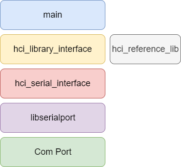

# Introduction
The hci_host_reference_design is a simple CLI application interfacing to GEM series of modules from North Pole Engineering. The purpose of this application is to demonstrate the capabiliities of the GEM and, more importantly, to provide a cross platform reference design for interfacing to GEM from a host microprocessor. The code is written in ANSI 'C' standard using POSIX threads. It compiles on Windows (Msys2), Linux, MacOS, Android, FreeBSD and others. 

This application requires the libserialport library. This is a free, cross platform 'C' based serial port library available from [Sigrok](https://sigrok.org).

# Architecture

### main
The 'main' module implements the UI as a simple command line interface and also generates simulated data which is sent to the GEM at 1Hz. By default the application will go to the IDLE state and turn BLE advertising on. 

The CLI has the following options:

|Command | Name | Description |
|------- | ---- | ----------- |
|'h' | help              | Prints the Help menu |
|'a' | start advertising | Starts Advertising on the GEM |
|'s' | stop advertising  | Stops Advertising on the GEM |
|'i' | goto IDLE         | Puts the GEM into the IDLE state |
|'u' | goto IN-USE       | Puts the GEM into the IN-USE state |
|'p' | goto PAUSED       | Puts the GEM into the PAUSED state |
|'f' | goto FINISHED     | Puts the GEM in tot he FINISHED state |
|'+' | increase grade    | Increases the grade sent to the GEM by 5% |
|'-' | decrease grade    | Decreases the grade sent to the GEM by 5% |
|'q' | quit              | Quits the application |

### hci_library_interface
The Library Interface module provides the main API to the application. It interfaces the HCI Reference Library for packet framing and parsing and to the Serial Interface to send and receive messages to/from GEM. Functions in the Library Interface may be called in any context - this module will put any transmit messages on the TX thread if required. This module also handles the complexity of sending commands and recieving responses on seperate threads, allow the application to make synchronous calls form the application level. The application may also provide a callback for any received messages.

### hci_reference_lib
This is a pure ANSI 'C' library that handles the tasks of framing and parsing GEM HCI messages. It may be ported to any 'C' based system. This library defines a set of functions that any calling application must define in order to compile. In this application these functions are defined by the Library Interface. 

### hci_serial_interface 
Serial Interface provides an API to send serial messages to the com port and to recieve messages from the com port. This module interafaces to the libserialport library from Sigrok. All transmit and recieve threads are handled by this module using POSIX compliant threads. In additon this module provides a 1 second timer thread, which application can access to send data to the GEM module. And a one-shot timer thread which is used for message retries by the Library Interface. 

### LibSerialPort
LibSerialPort is a minimal, cross platform shared serial library that is compatible with Windows, Linux, MacOS, Android and FreeBSD. It is licensed under the [GNU Lesser General Public License, version 3 or later](https://www.gnu.org/licenses/lgpl-3.0.en.html). For more information on this library is available [here](https://sigrok.org/wiki/Libserialport).

### Comport
This application interfaces to a standard UART serial port. The settings (set by the hci_serial_interface module) are detailed in the table below.

|Setting|Value|
|-------|-----|
|Baud|115200|
|Data Bits|8|
|Stop Bits|1|
|Flow Control|None|
|Parity|None|

# Installation
This application may be built from source by cloning and running make. 

In addition, at least the following dependencies are required:

- [libserialport](https://sigrok.org/wiki/Libserialport)
- pthreads 

To build and run on **Windows** need to set up [MSYS2 (MinGW-w64 toolchain)](https://www.msys2.org/).

For building libserialport on MSYS2

* [Good Overview](https://sigrok.org/wiki/Windows#Native_build_using_MSYS2)
* [Readme and Script](https://sigrok.org/gitweb/?p=sigrok-util.git;a=tree;f=cross-compile/msys2)

The readme and script are very useful.

# To Run
To run the application, once it is built, simply type:

// On Windows
mycc COM*X* 

// In Linux, other
sudo mycc /dev/ttyUSB0

Where COMX and /dev/ttyUSB0 correspond to the serial port to which GEM is connected. 

